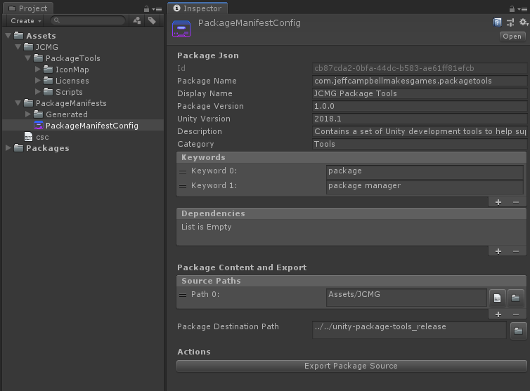

#  JCMG Package Tools
[](https://openupm.com/packages/com.jeffcampbellmakesgames.packagetools/)

## Overview
Unity package tools is a set of Unity Editor tools that make it easier for developer to share their own tools, plugins, etc... as packages that other users can then import via the native Unity Package Manager. It does this by:

* Providing one-button click functionality for copying the relevant source folders/files to a prescribed package export location.
* Automate creating and updating the package manager Json file.



## Installing JCMG Package Tools
Using this library in your project can be done in three ways:

### Install via OpenUPM
The package is available on the [openupm registry](https://openupm.com/). It's recommended to install it via [openupm-cli](https://github.com/openupm/openupm-cli).

```
openupm add com.jeffcampbellmakesgames.packagetools
```

### Install via GIT URL
Using the native Unity Package Manager introduced in 2017.2, you can add this library as a package by modifying your `manifest.json` file found at `/ProjectName/Packages/manifest.json` to include it as a dependency. See the example below on how to reference it.

```
{
	"dependencies": {
		...
		"com.jeffcampbellmakesgames.packagetools" : "https://github.com/jeffcampbellmakesgames/unity-package-tools.git#release/stable",
		...
	}
}
```

### Install via classic `.UnityPackage`
The latest release can be found [here](https://github.com/jeffcampbellmakesgames/unity-package-tools/releases) as a UnityPackage file that can be downloaded and imported directly into your project's Assets folder.

## Usage
To learn more about how to use JCMG Package Tools, see [here](./usage.md) for more information.

## Contributors
If you are interested in contributing, found a bug, or want to request a new feature, please see [here](./contributors.md) for more information.

## License
MIT License

Copyright (c) 2019 Jeff Campbell

Permission is hereby granted, free of charge, to any person obtaining a copy
of this software and associated documentation files (the "Software"), to deal
in the Software without restriction, including without limitation the rights
to use, copy, modify, merge, publish, distribute, sublicense, and/or sell
copies of the Software, and to permit persons to whom the Software is
furnished to do so, subject to the following conditions:

The above copyright notice and this permission notice shall be included in all
copies or substantial portions of the Software.

THE SOFTWARE IS PROVIDED "AS IS", WITHOUT WARRANTY OF ANY KIND, EXPRESS OR
IMPLIED, INCLUDING BUT NOT LIMITED TO THE WARRANTIES OF MERCHANTABILITY,
FITNESS FOR A PARTICULAR PURPOSE AND NONINFRINGEMENT. IN NO EVENT SHALL THE
AUTHORS OR COPYRIGHT HOLDERS BE LIABLE FOR ANY CLAIM, DAMAGES OR OTHER
LIABILITY, WHETHER IN AN ACTION OF CONTRACT, TORT OR OTHERWISE, ARISING FROM,
OUT OF OR IN CONNECTION WITH THE SOFTWARE OR THE USE OR OTHER DEALINGS IN THE
SOFTWARE.
